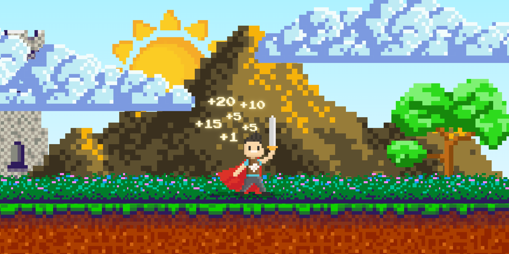

<h1 align="center">MSC ArcticBlaze🚀</h1>

<div style="align: center;">
  
</div>


Welcome to the **MSC Web Development Upskilling Challenge**! 🎉 Whether you're a beginner just starting your journey into web development or an experienced developer looking to level up your skills, this challenge has been designed to guide you through both **frontend** and **backend** web development, offering you hands-on experience and practical knowledge.

By the end of this program, you will have built a variety of projects, improved your problem-solving abilities, and learned to work with industry-standard tools and technologies. Plus, you can earn certificates to showcase your accomplishments!


---


## 🔍 **Challenge Overview**


### **What You'll Learn:**
- **Frontend Development:** Master the art of building responsive and dynamic websites using **HTML**, **CSS**, and **JavaScript**. Learn how to create intuitive user interfaces, optimize for performance, and improve user experience.
 
- **Backend Development:** Dive into server-side development using **Node.js** and **Express** to create robust web applications. You’ll also learn how to manage databases with **MongoDB** and handle backend logic like authentication, API development, and more.


---


## 🚧 **Course Structure**


The challenge is structured to provide both asynchronous and synchronous learning paths, allowing you to learn at your own pace or collaborate with others through live sessions.


### **Frontend Focus Areas:**
- **Responsive Design**: Master the use of **media queries** and **flexbox/grid** to build websites that work across devices.
- **JavaScript Interactivity**: Learn how to create dynamic elements using **vanilla JavaScript**.
- **Version Control**: Get comfortable using **Git** and **GitHub** for managing your projects and collaboration.


### **Backend Focus Areas:**
- **Server-Side Development**: Build and deploy backends using **Node.js** and **Express**.
- **Database Management**: Understand how to set up and manage a **MongoDB** database for storing user data.
- **API Development**: Create RESTful APIs for seamless frontend-backend communication.
- **Authentication & Security**: Implement user authentication and secure your application with best practices.


---


## 📚 **Learning Tracks**


You can choose between two learning modes based on your preference:


### **Asynchronous Track**:
- **Work at Your Own Pace**: Access all the learning materials, projects, and resources to progress through the challenge independently.
- **Documentation & Resources**: Explore [detailed resources](./Documentation/README.md) provided in the **Documentation** folder, including tutorials, articles, and code samples to help you at every stage of development.
 
### **Synchronous Track**:
- **Live Coding Sessions**: Attend live coding sessions and workshops via **Microsoft Teams** for interactive learning with real-time feedback. Participate in Q&A sessions, coding challenges, and peer reviews.
- **Study Groups**: Collaborate with fellow learners in group study sessions to share knowledge and solve coding challenges together.


---


## 🛠️ **How to Get Started**


1. **Clone the Repository**: Get started by downloading the project to your local machine.
   ```bash
   git clone https://github.com/PUP-MSC-Web-Development/ArcticBlaze.git
   cd ArcticBlaze
   
2. **Explore the Documentation**: 📖 Browse the resources in the **Documentation** folder. Here, you’ll find instructions on setting up your development environment, working with Git, and best practices for writing clean code.


3. **Choose a Project**: 📝 Select a project that matches your current skill level and learning goals. Projects are divided into **Frontend** and **Backend** categories inside the **Projects** folder.


4. **Join Study Sessions**: 📅 Everyone is encouraged to join our **Study Sessions**. These sessions are a great way to receive guidance and stay motivated.


5. **Submit Your Work**: 📤 Once you’ve completed a project, submit your work via a pull request (PR) to the repository. Your work will be reviewed, and feedback will be provided to help you improve.


---


## 🏆 **Certification Pathways**
As you progress through the challenge, completing key projects will unlock the opportunity to earn certifications that demonstrate your skills in web development. Here's what you need to know:


### Frontend Developer Certification:
- Complete the required frontend projects, including building a responsive portfolio, interactive web pages, and working with JavaScript.
### Backend Developer Certification:
- Complete backend-focused projects, like building a RESTful API, handling data with MongoDB, and implementing authentication with **JWT** or **OAuth**.
### Full Stack Developer Certification:
- Complete both frontend and backend tracks to earn this certification. You'll have built full-stack applications that demonstrate your ability to handle both the client-side and server-side logic.


Once you've completed all required projects in either the frontend, backend, or both, you'll be eligible to receive a certificate that you can showcase on your portfolio, LinkedIn, or resume.


---


## 💬 **Community & Support**
Throughout the challenge, you’ll have access to a supportive community of learners, mentors, and experienced developers. Join our **Discord channel** or **Microsoft Teams group** to:


- Ask questions and get help when you're stuck.
- Share your progress and get feedback on your projects.
- Network with other developers and build your professional connections.


---


## 🤝 Contributions


We encourage learners to contribute to the challenge! If you’d like to share your own resources, report bugs, or suggest new projects, feel free to submit a pull request or open an issue. We’re always looking for ways to improve the challenge for everyone.


---


## 📩 **Stay Updated**
Make sure to regularly check the **Announcements** section for updates on new projects, additional resources, and live session schedules. Don’t miss out on new opportunities to enhance your skills!


---


Let’s start building! 🚀
